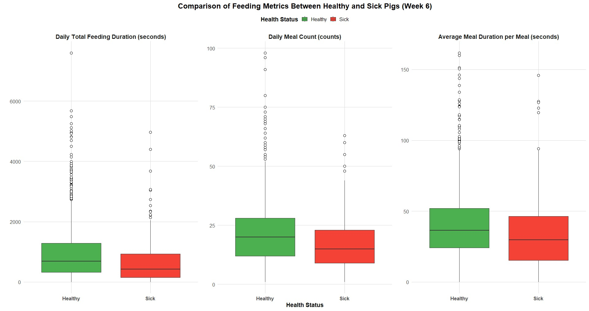

# 🐷 Internship Project: Tracking Health in Weaned Piglets through Feeding Patterns using RFID

This project was conducted during an internship at **Wageningen Livestock Research** to perform a statistical analysis on **RFID feeder log data**. The primary goal was to identify and validate **behavioural indicators** for the **early detection of biting-related health deviations** in weaned piglets.

| **Focus** | **Precision Livestock Farming (PLF), Behavioural Analysis, Animal Welfare** |
  | :--- | :--- |
  | **Duration** | July 2024 - January 2025 |
  | **Tool** | **R Studio** |

---

## 1. Project Goal & Scientific/Business Impact

### Objective
This study aimed to determine if **deviations in feeding patterns**, detected through **RFID technology**, could indicate **biting-related health issues** in weaned piglets. This addresses the need for non-invasive, early detection methods.

### Scientific Impact
Implemented the **Bout Criterion** methodology (based on the Akaike Information Criterion, AIC) to segment noisy RFID visits into meaningful 'Meal Events'—a common challenge in feeder data analysis.

### Potential Business Value
By providing insight into early health indicators based on behaviour, the analysis contributes to **improving animal welfare** and potentially **reducing mortality/losses** associated with biting behaviours, leading to better **farm management decisions**.

---

  ## 2. Technical Pipeline: Robust 4-Step Analysis in R
  
  The analysis pipeline was designed to meticulously clean raw sensor data and build reliable behavioural features for statistical comparison. The pipeline is fully documented across the following four R scripts in the `src/` directory.

| File | Pipeline Step | Core Functionality & Logic |
  | :--- | :--- | :--- |
  | **`01_...Cleaning.R`** | **Data Ingestion & Cleaning** | Aggregates log files from multiple PC sources and filters data based on farm physical constraints (e.g., impossible AntNo/Pen combinations). |
  | **`02_...Feature.R`** | **Critical Feature Engineering** | **Bout Criterion (58.5 seconds)** implementation: Defines the start/end and calculates the true `meal_duration_secs` for each feeding event. |
  | **`03_...Aggregation.R`** | **Behavioural Aggregation** | Filters out **unstable data** (first 3 days, last day of experiment) and aggregates individual meal events into reliable **daily, pig-level metrics** (`Total Duration`, `Meal Count`). |
  | **`04_...Comparison.R`** | **Statistical Comparison & Viz** | Merges with manual health scores, performs **Mann-Whitney U Tests**, and generates the final boxplots to validate health-based behavioural differences. |

---

## 3. Key Findings & Conclusion

Based on the statistical analysis, the hypothesis of differential feeding patterns was validated.

* **Statistical Significance:** The differences in **Total Daily Feeding Duration** and **Daily Meal Count** between the Sick Pig group and the Healthy Pig group were **highly statistically significant** ($p < 0.001$).
* **Behavioural Indicators:** Biting-affected piglets exhibited **significantly lower (shorter/fewer) feeding activity** compared to healthy piglets, particularly during the peak biting week.
* **Conclusion:** Deviations in feeding patterns, measured using the Bout Criterion, non-invasive tool for the proactive detection of early health issues in piglets.

### Visualisation: Feeding Patterns vs. Health Status

Statistical plot confirming that sick piglets exhibit **significantly lower** Total Meal Duration and Meal Count compared to healthy piglets during the critical period (Week 6).

---

## 4. Repository Structure & Contact

| File / Folder | Purpose |
| :--- | :--- |
| `R Scripts/` | **The four core R analysis scripts (01 to 04).** |
| `plots/` | **The final visualization results** |

---
| **Author** | **Jiwon(Jin) Ha** |
| :--- | :--- |
| **LinkedIn** | **https://www.linkedin.com/in/jiwon-ha** |
| **Email** | **haj180723@gmail.com** |

